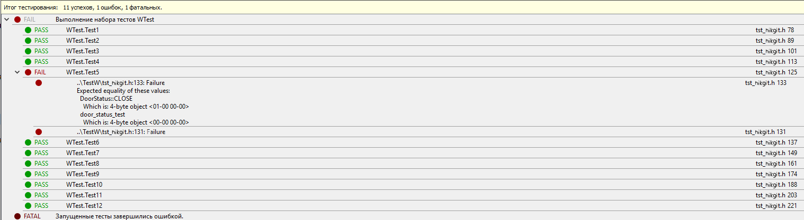

МИНИСТЕРСТВО НАУКИ И ВЫСШЕГО ОБРАЗОВАНИЯ РОССИЙСКОЙ ФЕДЕРАЦИИ\
Федеральное государственное автономное образовательное учреждение высшего образования\
"КРЫМСКИЙ ФЕДЕРАЛЬНЫЙ УНИВЕРСИТЕТ им. В. И. ВЕРНАДСКОГО"\
ФИЗИКО-ТЕХНИЧЕСКИЙ ИНСТИТУТ\
Кафедра компьютерной инженерии и моделирования\
  
​
### Отчёт по лабораторной работе № 9  по дисциплине "Программирование"
 

студента 1 курса группы ПИ-б-о-192(2)\
Кодаченко Никиты Владимировича\
направления подготовки 09.03.04 "Программная инженерия"\
 
​
<table>
<tr><td>Научный руководитель  старший преподаватель кафедры компьютерной инженерии и моделирования</td>
<td>(оценка)</td>
<td>Чабанов В.В.</td>
</tr>
</table>
  
​
Симферополь, 2020

### Цель: 
1. Познакомиться с Google Test и Google Mock Framework;
2. Изучить базовые понятия относящийся к тестированию кода;
3. Научиться тестировать классы в среде разработки Qt Creator.

### Ход работы

1. Результат тестирования приложения
\
*Рис.1 Результаты тестирования*
2. Ошибка возникла в результате неправильного написанного метода "LockDoor" класса "LockController". Ошибка состояла в инвертирования действия.\
3. Для того чтобы "пофиксить" данную ошибку, необходимо изменить метод таким образом
~~~c++
DoorStatus LockController::lockDoor()
{
    return latch->close();
}
~~~
4. [Ссылка на проект](https://github.com/NikitaGitHub19/GitHubCFU/tree/master/Lab9/TestW "Тестовый проект")
5. Причины возникновения ошибки могут быть различными, от обычного "Ctrl+c, Ctrl+v" забыв поменять метод или же проблемы в самом методе или его названии.

### Вывод
Я познакомился с Google Test и Google Mock Framework. Изучил базовые понятия относящийся к тестированию кода. Научился тестировать классы в среде разработки Qt Creator и выявлять ошибки в классах.
